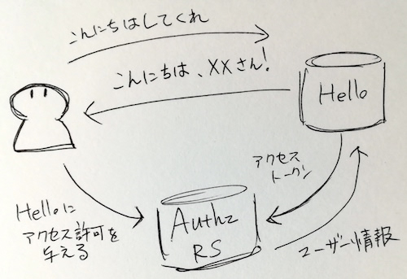
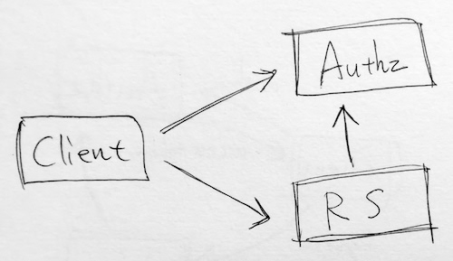
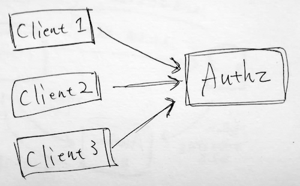
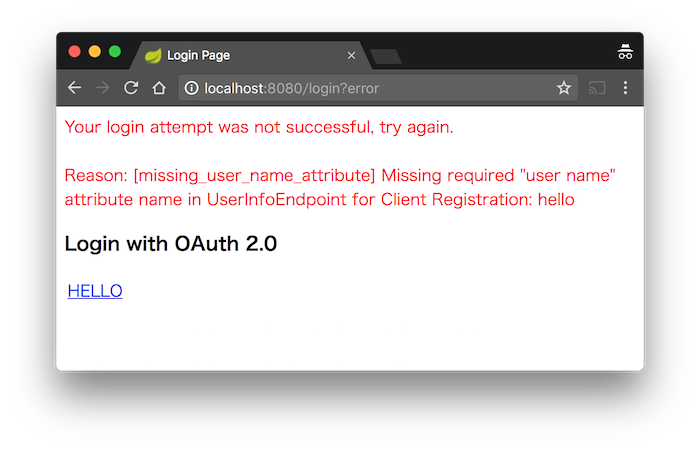

class: center, middle

# SpringでOAuth 2.0<br/>OpenID Connect 1.0を使う

https://github.com/backpaper0/spring-fest-2017

---

## 自己紹介

* うらがみ⛄️
* 大阪でSIerをしているJavaプログラマ
* Spring歴1年（Seasar2 → Java EE 6,7 → Spring）
* OAuth 2.0とOpenID Connectは仕事で扱ったことはない
* 完全に趣味のセッション

---

class: center, middle

## Spring BootとOAuth 2.0

---

### OAuth 2.0の詳しい話は省略

仕様書が日本語訳されているので気になる人は読んでください

* http://openid-foundation-japan.github.io/rfc6749.ja.html

---

### OAuth 2.0の登場人物

* リソースオーナー
* リソースサーバー
* クライアント
* 認可サーバー

---

### OAuth 2.0の登場人物

* リソースオーナー 👈 ユーザー
* リソースサーバー 👈 Springでできるよ
* クライアント 👈 Springでできるよ
* 認可サーバー 👈 Springでできるよ

依存に`spring-cloud-starter-oauth2`を追加するだけ

---

### OAuth 2.0の登場人物

* リソースオーナー
* リソースサーバー 👈`@EnableResourceServer`
* クライアント 👈`@EnableOAuth2Sso`, `@EnableOAuth2Client`
* 認可サーバー 👈`@EnableAuthorizationServer`

こんなアノテーションでできる

---

### spring-cloud-starter-oauth2の例

* こんにちは！するだけのウェブサイト(OAuth 2.0クライアント)と、
* 認可してユーザー情報を返す認可サーバー兼リソースサーバーを作る

---

### spring-cloud-starter-oauth2の例

イメージ

.image[
]

---

### 認可サーバー兼リソースサーバーの準備

```console
curl https://start.spring.io/starter.tgz \
     -d dependencies=cloud-oauth2 \
     -d baseDir=authz \
     -d name=authz \
     -d type=gradle-project \
     -d bootVersion=1.5.8.RELEASE | tar -xzvf -
```

???

Spring Initializrで楽ちん。

---

### 認可サーバー兼リソースサーバーの準備

```console
curl https://start.spring.io/starter.tgz \
*    -d dependencies=cloud-oauth2 \
     -d baseDir=authz \
     -d name=authz \
     -d type=gradle-project \
     -d bootVersion=1.5.8.RELEASE | tar -xzvf -
```

???

spring-cloud-starter-oauth2を依存に追加している。

---

### 認可サーバー兼リソースサーバーのコード

```java
@SpringBootApplication
@EnableAuthorizationServer
@EnableResourceServer
@RestController
public class AuthzApplication {
  public static void main(String[] args) {
    SpringApplication.run(AuthzApplication.class, args);
  }
  @GetMapping("/userinfo")
  public Object userinfo(Authentication a) {
    return a;
  }
}
```

???

(ここまで5分)

---

### 認可サーバー兼リソースサーバーのコード

```java
@SpringBootApplication
*@EnableAuthorizationServer
@EnableResourceServer
@RestController
public class AuthzApplication {
  public static void main(String[] args) {
    SpringApplication.run(AuthzApplication.class, args);
  }
  @GetMapping("/userinfo")
  public Object userinfo(Authentication a) {
    return a;
  }
}
```

???

認可サーバーの機能を有効にする。

認可エンドポイントやトークンエンドポイント、それらへのセキュリティ設定が有効化される。

---

### 認可サーバー兼リソースサーバーのコード

```java
@SpringBootApplication
@EnableAuthorizationServer
*@EnableResourceServer
@RestController
public class AuthzApplication {
  public static void main(String[] args) {
    SpringApplication.run(AuthzApplication.class, args);
  }
  @GetMapping("/userinfo")
  public Object userinfo(Authentication a) {
    return a;
  }
}
```

???

リソースサーバーの機能を有効にする。

リソースへのセキュリティ設定が有効化される。

---

### 認可サーバー兼リソースサーバーのコード

```java
@SpringBootApplication
@EnableAuthorizationServer
@EnableResourceServer
*@RestController
public class AuthzApplication {
  public static void main(String[] args) {
    SpringApplication.run(AuthzApplication.class, args);
  }
* @GetMapping("/userinfo")
* public Object userinfo(Authentication a) {
*   return a;
* }
}
```

???

リソースサーバーが提供するリソース。

---

### 認可サーバー兼リソースサーバーの設定

```none
server.context-path=/authz
server.port=9090

security.user.name=duke
security.user.password=javajava
security.user.role=DOWNLOAD

security.oauth2.client.client-id=hello
security.oauth2.client.client-secret=secret
security.oauth2.client.scope=user
```

???

application.propertiesの内容。

---

### 認可サーバー兼リソースサーバーの設定

```none
server.context-path=/authz
server.port=9090

*security.user.name=duke
*security.user.password=javajava
*security.user.role=DOWNLOAD

security.oauth2.client.client-id=hello
security.oauth2.client.client-secret=secret
security.oauth2.client.scope=user
```

???

リソースオーナーの情報。
ユーザー名、パスワード、ロール。

Spring Securityで遊んでいるとよく見る設定。

---

### 認可サーバー兼リソースサーバーの設定

```none
server.context-path=/authz
server.port=9090

security.user.name=duke
security.user.password=javajava
security.user.role=DOWNLOAD

*security.oauth2.client.client-id=hello
*security.oauth2.client.client-secret=secret
*security.oauth2.client.scope=user
```

???

クライアントの情報。
クライアントID、クライアントシークレット、スコープ。

これで認可サーバー兼リソースサーバーは完成。

---

### こんにちは！ウェブサイトの準備

```console
curl https://start.spring.io/starter.tgz \
     -d dependencies=cloud-oauth2 \
     -d baseDir=hello \
     -d name=hello \
     -d type=gradle-project \
     -d bootVersion=1.5.8.RELEASE | tar -xzvf -
```

???

次はクライアント側。

---

### こんにちは！ウェブサイトのコード

```java
@SpringBootApplication
@EnableOAuth2Sso
@RestController
public class HelloApplication {
  public static void main(String[] args) {
    SpringApplication.run(HelloApplication.class, args);
  }
  @GetMapping
  public String sayHello(Authentication a) {
    return String.format("Hello, %s!", a.getName());
  }
}
```

---

### こんにちは！ウェブサイトのコード

```java
@SpringBootApplication
*@EnableOAuth2Sso
@RestController
public class HelloApplication {
  public static void main(String[] args) {
    SpringApplication.run(HelloApplication.class, args);
  }
  @GetMapping
  public String sayHello(Authentication a) {
    return String.format("Hello, %s!", a.getName());
  }
}
```

???

OAuth 2.0による認可処理を利用して認証する設定。

---

### こんにちは！ウェブサイトのコード

```java
@SpringBootApplication
@EnableOAuth2Sso
@RestController
public class HelloApplication {
  public static void main(String[] args) {
    SpringApplication.run(HelloApplication.class, args);
  }
  @GetMapping
* public String sayHello(Authentication a) {
    return String.format("Hello, %s!", a.getName());
  }
}
```

???

このAuthenticationにリソースサーバーから返されるユーザー情報が入る。

---

### こんにちは！ウェブサイトの設定

```none
security.oauth2.client.client-id=hello
security.oauth2.client.client-secret=secret

security.oauth2.client.user-authorization-uri=\
http://localhost:9090/authz/oauth/authorize
security.oauth2.client.access-token-uri=\
http://localhost:9090/authz/oauth/token
security.oauth2.resource.user-info-uri=\
http://localhost:9090/authz/userinfo
```

---

### こんにちは！ウェブサイトの設定

```none
*security.oauth2.client.client-id=hello
*security.oauth2.client.client-secret=secret

security.oauth2.client.user-authorization-uri=\
http://localhost:9090/authz/oauth/authorize
security.oauth2.client.access-token-uri=\
http://localhost:9090/authz/oauth/token
security.oauth2.resource.user-info-uri=\
http://localhost:9090/authz/userinfo
```

???

(ここまで10分)

クライアントの情報。

---

### こんにちは！ウェブサイトの設定

```none
security.oauth2.client.client-id=hello
security.oauth2.client.client-secret=secret

*security.oauth2.client.user-authorization-uri=\
*http://localhost:9090/authz/oauth/authorize
security.oauth2.client.access-token-uri=\
http://localhost:9090/authz/oauth/token
security.oauth2.resource.user-info-uri=\
http://localhost:9090/authz/userinfo
```

???

認可サーバーが提供する認可エンドポイントのURI。

認可エンドポイントは「helloっていうクライアントにユーザー情報へのアクセスを許可するかい？」「うん、いいよー」をするためのもの。

---

### こんにちは！ウェブサイトの設定

```none
security.oauth2.client.client-id=hello
security.oauth2.client.client-secret=secret

security.oauth2.client.user-authorization-uri=\
http://localhost:9090/authz/oauth/authorize
*security.oauth2.client.access-token-uri=\
*http://localhost:9090/authz/oauth/token
security.oauth2.resource.user-info-uri=\
http://localhost:9090/authz/userinfo
```

???

認可サーバーが提供するトークンエンドポイントのURI。

トークンエンドポイントは認可コードとアクセストークンを引き換えるもの。

---

### こんにちは！ウェブサイトの設定

```none
security.oauth2.client.client-id=hello
security.oauth2.client.client-secret=secret

security.oauth2.client.user-authorization-uri=\
http://localhost:9090/authz/oauth/authorize
security.oauth2.client.access-token-uri=\
http://localhost:9090/authz/oauth/token
*security.oauth2.resource.user-info-uri=\
*http://localhost:9090/authz/userinfo
```

???

リソースサーバーが提供するユーザー情報エンドポイントのURI。

このエンドポイントがAuthenticationの元になる。

---

### 動かしてみる

`authz`と`hello`を両方起動して http://localhost:8080 にアクセスする

???

※会場でデモをする

---

### こんにちは！例の構成

.image[

]

認可サーバーとリソースサーバーが1つのSpring Bootアプリケーションに同居

???

認可サーバー equal リソースサーバーなので、クライアントからリソースサーバーへ送られたアクセストークンを検証できるのは自明。

---

### OAuth 2.0ログイン処理の流れ

* ブラウザでこんにちは！ウェブサイトを開こうとする
* ログインしていないので認可エンドポイント(`AuthorizationEndpoint.authorize`)にリダイレクト(`OAuth2ClientAuthenticationProcessingFilter`が投げた`UserRedirectRequiredException`を`OAuth2ClientContextFilter`の`catch`で処理)
* 認可サーバーで認証(Basic認証)

---

### OAuth 2.0ログイン処理の流れ

* こんにちは！ウェブサイトへリソースのアクセス許可を出す(`AuthorizationEndpoint.approveOrDeny`)
* 認可コードを添えてこんにちは！ウェブサイトへリダイレクト
* トークンエンドポイント(`TokenEndpoint`)で認可コードとアクセストークンを引き換える
* アクセストークンを添えて`/userinfo`へリクエストを投げてユーザー情報を取得する(`OAuth2AuthenticationProcessingFilter`で`Authentication`を`SecurityContext`へセット)

---

### 他の構成

.image[

]

ログインしたいだけなら認可サーバーだけにすることも可能

???

アクセストークンからAuthenticationを得る必要があるが、この場合はユーザー情報エンドポイントの代わりにチェックトークンエンドポイントがAuthenticationを返す。

チェックトークンエンドポイントはspring-security-oauth2が提供する認可サーバーの機能。

少しコードを見てみる。

---

### 認可サーバーだけのコード

```java
@SpringBootApplication
@EnableAuthorizationServer
//@EnableResourceServer
//@RestController
public class AuthzApplication {
  public static void main(String[] args) {
    SpringApplication.run(AuthzApplication.class, args);
  }
//  @GetMapping("/userinfo")
//  public Object userinfo(Authentication a) {
//    return a;
//  }
}
```

???

リソースサーバー関連のコードを削除する。

---

### 認可サーバーだけの設定

先述の設定に次の設定を追加する

```none
security.oauth2.authorization.check-token-access=\
isAuthenticated()
```

???

チェックトークンエンドポイントはデフォルトではアクセス拒否されるので、アクセス制御の設定をしないといけない。

---

### クライアント側の設定

先述の設定を次のように変更する

```none
#security.oauth2.resource.user-info-uri=\
#http://localhost:9090/authz/userinfo
security.oauth2.resource.token-info-uri=\
http://localhost:9090/authz/oauth/check_token
```

???

ユーザー情報エンドポイントのURI設定を削除して、チェックトークンエンドポイントのURI設定を追加する。

---

### 他の構成

.image[

]

認可サーバーとリソースサーバーを分けることももちろん可能

???

(ここまで15分)

リソースサーバーから認可サーバーへ伸びている矢印がポイント。

認可サーバーとリソースサーバー間のやりとりはOAuth 2.0の仕様の範囲外。
spring-security-oauth2の場合は認可サーバーへアクセストークンを投げてAuthenticationを取得することで認可済みだと判断する。

この場合リソースサーバーはクライアントからアクセストークンを受け取って、それを認可サーバーへリレーしてAuthenticationを取得している。

---

### リソースサーバーのコード

```java
@SpringBootApplication
@EnableResourceServer
@RestController
public class ResourceApplication {
  public static void main(String[] args) {
      SpringApplication.run(ResourceApplication.class, args);
  }
  @GetMapping("/hello")
  public String sayHello(Authentication a) {
      return String.format("Hello, %s!", a.getName());
  }
}
```

???

これまでのコードの応用になるが、一応コードを紹介する。

クライアントで行っていたこんにちは処理をリソースサーバーに持ってきた。

---

### リソースサーバーの設定

```none
server.context-path=/resource
server.port=7070

security.oauth2.resource.user-info-uri=\
http://localhost:9090/authz/userinfo
```

???

アクセストークンをリレーしてAuthenticationを取得するだけなのでユーザー情報エンドポイントのURI設定だけで良い。

---

### クライアントのコード

```java
private final OAuth2RestTemplate restTemplate;

@GetMapping
public String sayHello() {
  return restTemplate.getForObject(
    "http://localhost:7070/resource/hello", String.class);
}
```

???

OAuth2RestTemplateを使ってリソースサーバーからこんにちはを取得する。

なお、設定ファイルは特に変更しない。

---

### ここまでのおさらい

* `spring-cloud-starter-oauth2`を使えば認可サーバー、リソースサーバー、クライアントを構築できる
* 認可サーバーとリソースサーバーは兼任させたり、個々で立てたりできる
* それらは全てアノテーションと`application.properties`でできる

---

### カスタマイズしたい

* 複数のクライアントを扱いたい
* クライアントの情報はDBで管理したい
* クライアントシークレットをハッシュ化したい
* 発行されたアクセストークンをJDBCで管理したい
* etc...

---

### 複数のクライアントを扱いたい

.image[

]

クライアント1、2、3それぞれに異なるクライアントIDを振りたい

---

### クライアント情報構築のデフォルトの動作

* `OAuth2AutoConfiguration`がインポートした`OAuth2AuthorizationServerConfiguration`にstaticにネストした`BaseClientDetailsConfiguration`が`BaseClientDetails`をbean登録
* `OAuth2AuthorizationServerConfiguration`の`configure`でクライアント情報を管理する`ClientDetailsService`を構築

👉 クライアント情報は1つしか持てない

???

application.propertiesに書かれたクライアント情報を元にこんな感じで構築。

---

### 複数クライアント情報の構築

* `AuthorizationServerConfigurer`を実装したコンポーネントを用意する(`AuthorizationServerConfigurerAdapter`を継承してもよい)
* `configure`メソッドでクライアント情報を構築する

---

### AuthorizationServerConfigurer実装クラス

```java
@Component
class AuthzConfig
    extends AuthorizationServerConfigurerAdapter {
  @Override
  public void configure(
    ClientDetailsServiceConfigurer clients)
      throws Exception {
    //ここでクライアント情報を構築する
  }
}
```

???

横に長くなりがちで、ありえない改行をしていてごめん。

---

### configureメソッド

```java
clients.inMemory()
  .withClient("hello").secret("secret").scopes("user")
     .authorizedGrantTypes("authorization_code")
  .and()
  .withClient("client2").secret("secret2").scopes("user")
     .authorizedGrantTypes("authorization_code")
  .and()
  .withClient("client3").secret("secret3").scopes("user")
     .authorizedGrantTypes("authorization_code");
```

???

configureメソッドの引数clientsがビルダーになっており、こんな感じでクライアント情報を構築できる。

これまでの例ではauthorizedGrantTypesは指定していなかったけど、BaseClientDetailsConfigurationが設定してくれていたから。

これで複数クライアントに対応できた。

---

### クライアント情報をDBで管理したい

デフォルトだとクライアント情報はインメモリで持っている

DBで管理したい場合もやはり`AuthorizationServerConfigurer`実装クラスでカスタマイズする。

---

### クライアント情報をDBで管理したい

```java
private final DataSource dataSource;

@Override
public void configure(
    ClientDetailsServiceConfigurer clients)
    throws Exception {
  //clients.inMemory()... デフォルトはインメモリ
  clients.jdbc(dataSource);
}
```

???

(ここまで20分)

ClientDetailsServiceConfigurerのjdbcメソッドにDataSourceを渡せばOK。

---

### クライアント情報が格納されるテーブル

* `spring-security-oauth`プロジェクトの`spring-security-oauth2/src/test/resources/schema.sql`にDDLがある
* `JdbcClientDetailsService`の`setFindClientDetailsSql`メソッドなどで発行されるクエリをカスタマイズできるのでオレオレ定義なテーブルにも対応できる
* Spring Securityの`JdbcUserDetailsManager`みたいな雰囲気

???

src/main/resourcesにあればspring-security-oauth2のJARに同梱されるからFlywayあたりでマイグレーションできるのになぁ、と思ったりする。

---

### オレオレClientDetailsService実装を使う

```java
//clients.inMemory()...

//clients.jdbc(dataSource)...

ClientDetailsService clientDetailsService =
  new OreOreClientDetailsServiceImpl();
clients.withClientDetails(clientDetailsService);
```

???

用意されているClientDetailsService実装はインメモリとJDBCの2つだけ。

もっと別の方法でクライアント情報を管理したい場合はClientDetailsServiceを実装して、それをwithClientDetailsに渡せばよい。

---

### クライアントシークレットをハッシュ化したい

デフォルトだとクライアントシークレットは平文で管理される

---

### クライアントシークレットをハッシュ化したい

ハッシュ化するためには、

* `ClientDetailsService`に登録するクライアントシークレットをハッシュ化する
* `AuthorizationServerConfigurer`で`AuthorizationServerSecurityConfigurer`に`PasswordEncoder`を設定する

---

### クライアントシークレットをハッシュ化したい

```java
@Component
class AuthzConfig
    extends AuthorizationServerConfigurerAdapter {

* final PasswordEncoder passwordEncoder =
*   new BCryptPasswordEncoder();

  ...
}
```

???

まずAuthorizationServerConfigurer実装クラスにPasswordEncoderのフィールドを準備。

もちろんSpringのコンポーネントにしてもよい。

---

### クライアントシークレットをハッシュ化したい

```java
@Override
public void configure(
    ClientDetailsServiceConfigurer clients)
    throws Exception {
  clients.inMemory().withClient("hello")
*   .secret(passwordEncoder.encode("secret"))
    .scopes("user")
    .authorizedGrantTypes("authorization_code");
}
```

???

次に、クライアント情報を登録する時にパスワードをハッシュ化しておく。

---

### クライアントシークレットをハッシュ化したい

```java
@Override
public void configure(
    AuthorizationServerSecurityConfigurer security)
    throws Exception {
*  security.passwordEncoder(passwordEncoder);
}
```

???

最後に、AuthorizationServerSecurityConfigurerを引数に取る方のconfigureメソッドでPasswordEncoderを設定する。
これはクライアントから送信されたクライアントシークレットを認証する時に使う。

---

### 発行されたアクセストークンをJDBCで管理したい

* 発行されたアクセストークンは`TokenStore`に保存される
* デフォルトで選択される実装は`InMemoryTokenStore`

---

### 発行されたアクセストークンをJDBCで管理したい

`AuthorizationServerConfigurer`の`AuthorizationServerEndpointsConfigurer`を引数に取る`configure`メソッドで実装を切り替える

---

### 発行されたアクセストークンをJDBCで管理したい

```java
@Override
public void configure(
    AuthorizationServerEndpointsConfigurer endpoints)
    throws Exception {
* endpoints.tokenStore(new JdbcTokenStore(dataSource));
}
```

DDLは先ほどと同じく`spring-security-oauth2/src/test/resources/schema.sql`にある

---

### AuthorizationServerEndpointsConfigurerで設定できる他のもの

* `AuthorizationServerTokenServices`
* `TokenEnhancer`
* `AccessTokenConverter`
* `ApprovalStore`
* `TokenGranter`
* etc...

???

AuthorizationServerTokenServicesはアクセストークンを生成するもの。
アクセストークンを好きな体系にできる。

TokenEnhancerはアクセストークンを生成する過程でアクセストークンを変更できるもの。
AuthorizationServerTokenServicesのデフォルト実装、DefaultTokenServicesの内部で呼ばれる。
単純にアクセストークンに情報を付与したい場合はAuthorizationServerTokenServicesに手を加えるよりも楽。
アクセストークンをJWTにできるJwtAccessTokenConverterなんかが用意されていたりする。

ApprovalStoreはリソースオーナーがクライアントに出した許可を記憶しておくもの。
デフォルトはやはりインメモリなのでDBに保存しておきたい場合などにカスタマイズするポイント。

TokenGranterは認可グラントのインターフェース。ここまで何も言わずにきたけど、このセッションではずっとグラントタイプが認可コードの場合を話してきた。
他にもインプリシット、リソースオーナーパスワードクレデンシャル、クライアントクレデンシャルが使える。
独自の認可グラントを作成する場合にカスタマイズするポイント。

---

### ここまでのおさらい

* 認可サーバーはデフォルトだと扱うクライアントは1つで、いろんな情報をインメモリに持つ
* 扱うクライアントを増やしたり、情報をDBなどに持ちたい場合はJava Configで設定を変えたりコンポーネント定義をして実装を切り替える
* いろいろとカスタマイズする余地はある

???

(ここまで25分)

認可サーバーのカスタマイズは後ほどOpenID Connectの話をする時にも出てくる。

---

class: center, middle

## Spring Security 5とOAuth 2.0

---

### Spring Security 5にOAuth 2.0対応が入る

これまで紹介してきたのは`spring-security-oauth2`の機能で、Spring Bootでは`spring-security-oauth2`は`spring-cloud-starter-oauth2`経由で依存関係に追加される

Spring Security 5からはSpring Security自体にOAuth 2.0対応が入る

Spring Security 5.0.0.RC1ではOAuth 2.0によるログイン機能が入っている

---

### 5.0.0.RC1のOAuth 2.0ログインを試す

まずは準備

```console
curl https://start.spring.io/starter.tgz \
*    -d dependencies=web,security \
     -d baseDir=hello2 \
     -d name=hello2 \
     -d type=gradle-project \
     -d bootVersion=2.0.0.M6 | tar -xzvf -
```

???

先ほどまではdependenciesにcloud-oauth2を指定していたが、ここではwebとsecurityを指定

---

### OAuth 2.0ログインの準備

`build.gradle`に依存を足す

```none
compile('org.springframework.security:'
  + 'spring-security-oauth2-client')
compile('org.springframework.security:'
  + 'spring-security-oauth2-jose')
```

---

### アプリケーションのコード

```java
@SpringBootApplication
@RestController
public class Hello2Application {
  public static void main(final String[] args) {
    SpringApplication.run(Hello2Application.class, args);
  }
  @GetMapping
  public String sayHello(final Authentication a) {
    return String.format("Hello, %s!!!", a.getName());
  }
}
```

???

一番最初に示したこんにちは！ウェブサイトのコードとほぼ同じ。
@EnableOAuth2Ssoがなくなった。

---

### セキュリティ設定のコード

```java
@Configuration
class Hello2Config extends WebSecurityConfigurerAdapter {
  @Override
  protected void configure(HttpSecurity http)
      throws Exception {
    http.authorizeRequests().anyRequest().authenticated()
*     .and().oauth2Login().clientRegistrationRepository(
*       clientRegistrationRepository());
  }
  ...
}
```

???

見慣れたWebSecurityConfigurerのコードにoauth2Loginメソッド呼び出しと、clientRegistrationRepositoryメソッド呼び出しが加わる。

---

### ClientRegistrationRepositoryの構築(前半)

```java
@Bean
public ClientRegistrationRepository
    clientRegistrationRepository() {
  ClientRegistration registration = ClientRegistration
    .withRegistrationId("hello")
    .clientName("HELLO")
    .clientId("hello")
    .clientSecret("secret")
    .scope("user")
    .authorizationGrantType(
      AuthorizationGrantType.AUTHORIZATION_CODE)
```

???

ClientRegistrationRepositoryの構築は少し縦に長いので2つに分けて説明する。

---

### ClientRegistrationRepositoryの構築(前半)

```java
@Bean
public ClientRegistrationRepository
    clientRegistrationRepository() {
  ClientRegistration registration = ClientRegistration
*   .withRegistrationId("hello")
*   .clientName("HELLO")
    .clientId("hello")
    .clientSecret("secret")
    .scope("user")
    .authorizationGrantType(
      AuthorizationGrantType.AUTHORIZATION_CODE)
```

???

Spring Security 5のOAuth 2.0ログインでは複数のプロバイダを指定できる。

registrationIdはプロバイダの識別のために使う。

clientNameはプロバイダを示す表示用の名前。

---

### ClientRegistrationRepositoryの構築(前半)

```java
@Bean
public ClientRegistrationRepository
    clientRegistrationRepository() {
  ClientRegistration registration = ClientRegistration
    .withRegistrationId("hello")
    .clientName("HELLO")
*   .clientId("hello")
*   .clientSecret("secret")
*   .scope("user")
*   .authorizationGrantType(
*     AuthorizationGrantType.AUTHORIZATION_CODE)
```

???

clientId、clientSecret、scope、authorizationGrantTypeは先ほどまでの例と一緒の意味合い。

---

### ClientRegistrationRepositoryの構築(後半)

```java
    .authorizationUri(
      "http://localhost:9090/authz/oauth/authorize")
    .tokenUri("http://localhost:9090/authz/oauth/token")
    .redirectUri(
      "http://localhost:8080/login/oauth2/code/hello")
    .userInfoUri("http://localhost:9090/authz/userinfo")
    .userNameAttributeName("name")
    .build();
  return new InMemoryClientRegistrationRepository(
    registration);
}
```

---

### ClientRegistrationRepositoryの構築(後半)

```java
*   .authorizationUri(
*     "http://localhost:9090/authz/oauth/authorize")
*   .tokenUri("http://localhost:9090/authz/oauth/token")
*   .redirectUri(
*     "http://localhost:8080/login/oauth2/code/hello")
*   .userInfoUri("http://localhost:9090/authz/userinfo")
    .userNameAttributeName("name")
    .build();
  return new InMemoryClientRegistrationRepository(
    registration);
}
```

???

authorizationUri、tokenUri、redirectUri、userInfoUriは先ほどまでと同じ意味合い。
と言いつつredirectUriは初めて出てきたかな？
認可エンドポイントから認可コードを付与してリダイレクトされるURI。

---

### ClientRegistrationRepositoryの構築(後半)

```java
    .authorizationUri(
      "http://localhost:9090/authz/oauth/authorize")
    .tokenUri("http://localhost:9090/authz/oauth/token")
    .redirectUri(
      "http://localhost:8080/login/oauth2/code/hello")
    .userInfoUri("http://localhost:9090/authz/userinfo")
*   .userNameAttributeName("name")
    .build();
  return new InMemoryClientRegistrationRepository(
    registration);
}
```

???

(ここまで30分)

userNameAttributeNameはユーザー情報エンドポイントのレスポンスの中でどの項目がuserNameに当たるのかを設定する。

このuserNameAttributeNameが私を悩ませている。

---

### application.propertiesでも設定できる

```none
spring.security.oauth2.client.provider.authz.authorization-uri=http://localhost:9090/authz/oauth/authorize
spring.security.oauth2.client.provider.authz.token-uri=http://localhost:9090/authz/oauth/token
spring.security.oauth2.client.provider.authz.user-info-uri=http://localhost:9090/authz/userinfo
spring.security.oauth2.client.provider.authz.user-name-attribute=name

spring.security.oauth2.client.registration.hello.authorization-grant-type=authorization_code
spring.security.oauth2.client.registration.hello.client-id=hello
spring.security.oauth2.client.registration.hello.client-name=HELLO
spring.security.oauth2.client.registration.hello.client-secret=secret
spring.security.oauth2.client.registration.hello.provider=authz
spring.security.oauth2.client.registration.hello.redirect-uri=http://localhost:8080/login/oauth2/code/hello
spring.security.oauth2.client.registration.hello.scope=user
```

???

コードで設定していたけれど実はapplication.propertiesでも設定できる。

---

### application.propertiesでも設定できる

```none
*spring.security.oauth2.client.provider.authz.authorization-uri=http://localhost:9090/authz/oauth/authorize
*spring.security.oauth2.client.provider.authz.token-uri=http://localhost:9090/authz/oauth/token
*spring.security.oauth2.client.provider.authz.user-info-uri=http://localhost:9090/authz/userinfo
*spring.security.oauth2.client.provider.authz.user-name-attribute=name

spring.security.oauth2.client.registration.hello.authorization-grant-type=authorization_code
spring.security.oauth2.client.registration.hello.client-id=hello
spring.security.oauth2.client.registration.hello.client-name=HELLO
spring.security.oauth2.client.registration.hello.client-secret=secret
spring.security.oauth2.client.registration.hello.provider=authz
spring.security.oauth2.client.registration.hello.redirect-uri=http://localhost:8080/login/oauth2/code/hello
spring.security.oauth2.client.registration.hello.scope=user
```

???

application.propertiesで設定する時は、プロバイダーの設定と……

---

### application.propertiesでも設定できる

```none
spring.security.oauth2.client.provider.authz.authorization-uri=http://localhost:9090/authz/oauth/authorize
spring.security.oauth2.client.provider.authz.token-uri=http://localhost:9090/authz/oauth/token
spring.security.oauth2.client.provider.authz.user-info-uri=http://localhost:9090/authz/userinfo
spring.security.oauth2.client.provider.authz.user-name-attribute=name

*spring.security.oauth2.client.registration.hello.authorization-grant-type=authorization_code
*spring.security.oauth2.client.registration.hello.client-id=hello
*spring.security.oauth2.client.registration.hello.client-name=HELLO
*spring.security.oauth2.client.registration.hello.client-secret=secret
*spring.security.oauth2.client.registration.hello.provider=authz
*spring.security.oauth2.client.registration.hello.redirect-uri=http://localhost:8080/login/oauth2/code/hello
*spring.security.oauth2.client.registration.hello.scope=user
```

???

クライアントの設定を分けて行う。

---

### application.propertiesでも設定できる

```none
spring.security.oauth2.client.provider.authz.authorization-uri=http://localhost:9090/authz/oauth/authorize
spring.security.oauth2.client.provider.authz.token-uri=http://localhost:9090/authz/oauth/token
spring.security.oauth2.client.provider.authz.user-info-uri=http://localhost:9090/authz/userinfo
spring.security.oauth2.client.provider.authz.user-name-attribute=name

spring.security.oauth2.client.registration.hello.authorization-grant-type=authorization_code
spring.security.oauth2.client.registration.hello.client-id=hello
spring.security.oauth2.client.registration.hello.client-name=HELLO
spring.security.oauth2.client.registration.hello.client-secret=secret
*spring.security.oauth2.client.registration.hello.provider=authz
spring.security.oauth2.client.registration.hello.redirect-uri=http://localhost:8080/login/oauth2/code/hello
spring.security.oauth2.client.registration.hello.scope=user
```

???

クライアントの設定で使用するプロバイダを指定する。

このように、すべてapplication.propertiesで設定できる、、、

---

### けれど……

```none
spring.security.oauth2.client.provider.authz.authorization-uri=http://localhost:9090/authz/oauth/authorize
spring.security.oauth2.client.provider.authz.token-uri=http://localhost:9090/authz/oauth/token
spring.security.oauth2.client.provider.authz.user-info-uri=http://localhost:9090/authz/userinfo
spring.security.oauth2.client.provider.authz.user-name-attribute=name

spring.security.oauth2.client.registration.hello.authorization-grant-type=authorization_code
spring.security.oauth2.client.registration.hello.client-id=hello
spring.security.oauth2.client.registration.hello.client-name=HELLO
spring.security.oauth2.client.registration.hello.client-secret=secret
spring.security.oauth2.client.registration.hello.provider=authz
spring.security.oauth2.client.registration.hello.redirect-uri=http://localhost:8080/login/oauth2/code/hello
spring.security.oauth2.client.registration.hello.scope=user
```

---

### user-name-attribute...

```none
spring.security.oauth2.client.provider.authz.authorization-uri=http://localhost:9090/authz/oauth/authorize
spring.security.oauth2.client.provider.authz.token-uri=http://localhost:9090/authz/oauth/token
spring.security.oauth2.client.provider.authz.user-info-uri=http://localhost:9090/authz/userinfo
*spring.security.oauth2.client.provider.authz.user-name-attribute=name

spring.security.oauth2.client.registration.hello.authorization-grant-type=authorization_code
spring.security.oauth2.client.registration.hello.client-id=hello
spring.security.oauth2.client.registration.hello.client-name=HELLO
spring.security.oauth2.client.registration.hello.client-secret=secret
spring.security.oauth2.client.registration.hello.provider=authz
spring.security.oauth2.client.registration.hello.redirect-uri=http://localhost:8080/login/oauth2/code/hello
spring.security.oauth2.client.registration.hello.scope=user
```

???

ここで設定しているuser-name-attributeがSpring Boot 2.0.0.M6では使われていない。

なので……

---

### user-name-attribute...

.image[
]

???

こんなエラーになる。

application.propertiesのuser-name-attributeが機能してくれたら……

---

### WebSecurityConfigurerはこうなるはず

```java
@Configuration
class Hello2Config extends WebSecurityConfigurerAdapter {
  @Override
  protected void configure(HttpSecurity http)
      throws Exception {
    http.authorizeRequests().anyRequest().authenticated()
*     .and().oauth2Login()
  }
}
```

???

WebSecurityConfigurerのコードはかなりすっきりするはず。
clientRegistrationRepositoryの定義が要らなくなる。

バグっぽいから直ってくれるといいなー、と思ってる。
誰かPR投げませんか？

それはともかく、動作を見てみたい。

※会場でデモをする(GitHubログインのデモもしたい)

---

### OAuth 2.0ログインについてその他の情報

* `CommonOAuth2Provider`という`enum`に幾つかのプロバイダの設定がある
* Google、GitHub、Facebook、Okta

---

class: center, middle

## Spring Security 5と<br/>OpenID Connect Core 1.0

---

### OpenID Connect Core 1.0の詳しい話は省略

仕様書が日本語訳されているので気になる人は読んでください

* http://openid-foundation-japan.github.io/openid-connect-core-1_0.ja.html

---

### ざっくり言うと

* OpenID ConnectはOAuth 2.0がベース
* トークンエンドポイントがIDトークンを返す
* IDトークンはユーザー情報をJWTで表したもの
* JWTというのはJSONを含んだURLセーフなデータ形式で、署名ができる

???

ここで話しているのは認可グラントが認可コードの場合のみ。
認可グラントがインプリシットなら認可エンドポイントがIDトークン返したりする。

JWTの説明、これでいいのかな？
まあ、そんな感じです。

---

### OpenID Connectに対応する

```java
ClientRegistration registration =
  ClientRegistration.withRegistrationId("hello")
    .clientName("HELLO")
    .clientId("hello")
    .clientSecret("secret")
*   .scope("openid")
    //(中略)
    .build();
```

`scope`に`openid`を含めるだけ

???

(ここまで35分)

OpenID Connectはscopeにopenidを含まなければいけない。

openidというscopeの有無でOAuth2LoginAuthenticationProviderとOidcAuthorizationCodeAuthenticationProviderが使い分けられる。

---

### サーバー側のOpenID Connect対応は、、、

* (前半に紹介していた)`spring-security-oauth2`にはOpenID Connect対応は無い
* IDプロバイダーを実装したいという要求はそんなに無いと思うし、対応しなくても仕方ないか、、、
* でも実装したいよね？

---

### spring-security-oauth2でIDプロバイダになる

最低限、これらをすればIDプロバイダになれそう

* 認可エンドポイントでIDトークンを返す
* JWKの集合を返すエンドポイントを作成する

Nimbus OAuth 2.0/OpenID Connect SDKを使って実装してみた

???

なんて読むのかな？
ニンバス？
Spring Security 5も使っている。

JWKの集合はクライアントがIDトークンを検証する時に使う。
IDプロバイダーはIDトークンを秘密鍵で署名して、クライアントはJWK集合エンドポイントから取得した公開鍵で検証、という感じ。

---

### IDプロバイダの実装手順

* 準備
* JWKの集合を作る
* 認可エンドポイントでIDトークンを返す
* JWKの集合を返すエンドポイントを作成する

???

準備はビルドスクリプトの編集のみ。

JWKの集合はIDトークンの署名とエンドポイントの両方で使用する。

---

### 準備

最初に示した例の、認可サーバー兼リソースサーバー`authz`をベースにしている

```none
compile('com.nimbusds:oauth2-oidc-sdk:5.38')
compile('com.nimbusds:nimbus-jose-jwt:5.1')
```

???

JOSE = Javascript Object Signing and Encryption

---

### JWK(JSON Web Key)の集合を作る

```java
@Bean
public JWKSet jwkSet() {
  //try-catch省略
  KeyPairGenerator g = KeyPairGenerator.getInstance("RSA");
  g.initialize(2048);
  KeyPair kp = g.generateKeyPair();
  RSAKey rsaKey = new RSAKey.Builder(
      (RSAPublicKey) kp.getPublic())
    .privateKey((RSAPrivateKey) kp.getPrivate())
    .keyID(UUID.randomUUID().toString())
    .build();
  return new JWKSet(rsaKey);
}
```

---

### JWK(JSON Web Key)の集合を作る

```java
@Bean
public JWKSet jwkSet() {
  //try-catch省略
* KeyPairGenerator g = KeyPairGenerator.getInstance("RSA");
* g.initialize(2048);
* KeyPair kp = g.generateKeyPair();
  RSAKey rsaKey = new RSAKey.Builder(
      (RSAPublicKey) kp.getPublic())
    .privateKey((RSAPrivateKey) kp.getPrivate())
    .keyID(UUID.randomUUID().toString())
    .build();
  return new JWKSet(rsaKey);
}
```

???

まずRSA鍵ペアを作る。
これはJava SEのAPI。

もちろん、keytoolなどで事前に作っておいても良い。
というかたぶん普通は事前に作っておく。

---

### JWK(JSON Web Key)の集合を作る

```java
@Bean
public JWKSet jwkSet() {
  //try-catch省略
  KeyPairGenerator g = KeyPairGenerator.getInstance("RSA");
  g.initialize(2048);
  KeyPair kp = g.generateKeyPair();
  RSAKey rsaKey = new RSAKey.Builder(
*     (RSAPublicKey) kp.getPublic())
*   .privateKey((RSAPrivateKey) kp.getPrivate())
    .keyID(UUID.randomUUID().toString())
    .build();
  return new JWKSet(rsaKey);
}
```

???

次に公開鍵と秘密鍵をビルダーに渡して……

---

### JWK(JSON Web Key)の集合を作る

```java
@Bean
public JWKSet jwkSet() {
  //try-catch省略
  KeyPairGenerator g = KeyPairGenerator.getInstance("RSA");
  g.initialize(2048);
  KeyPair kp = g.generateKeyPair();
  RSAKey rsaKey = new RSAKey.Builder(
      (RSAPublicKey) kp.getPublic())
    .privateKey((RSAPrivateKey) kp.getPrivate())
*   .keyID(UUID.randomUUID().toString())
    .build();
  return new JWKSet(rsaKey);
}
```

???

このJSON Web KeyのIDを設定して……

このIDはJWK集合に含まれる鍵を識別するためのもの。

---

### JWK(JSON Web Key)の集合を作る

```java
@Bean
public JWKSet jwkSet() {
  //try-catch省略
  KeyPairGenerator g = KeyPairGenerator.getInstance("RSA");
  g.initialize(2048);
  KeyPair kp = g.generateKeyPair();
* RSAKey rsaKey = new RSAKey.Builder(
      (RSAPublicKey) kp.getPublic())
    .privateKey((RSAPrivateKey) kp.getPrivate())
    .keyID(UUID.randomUUID().toString())
*   .build();
  return new JWKSet(rsaKey);
}
```

???

buildするとRSAKeyを作成できる。

---

### JWK(JSON Web Key)の集合を作る

```java
@Bean
public JWKSet jwkSet() {
  //try-catch省略
  KeyPairGenerator g = KeyPairGenerator.getInstance("RSA");
  g.initialize(2048);
  KeyPair kp = g.generateKeyPair();
  RSAKey rsaKey = new RSAKey.Builder(
      (RSAPublicKey) kp.getPublic())
    .privateKey((RSAPrivateKey) kp.getPrivate())
    .keyID(UUID.randomUUID().toString())
    .build();
* return new JWKSet(rsaKey);
}
```

???

作成したRSAKeyを引数にしてJWKSetをインスタンス化する。
ちなみにRSAKeyクラスはJWKクラスのサブクラス。

この例では1つのRSA鍵しか含んでいないが、集合なので複数の鍵を含めることができる。

このビルダーやRSAKeyクラス、JWKSetクラすはNimbus OAuth 2.0/OpenID Connect SDKのAPI。

---

### 認可エンドポイントでIDトークンを返す

* 前半でちらっと紹介した`TokenEnhancer`を利用する
* `TokenEnhancer`は生成されたアクセストークンに追加の情報を加えられる
* 追加情報としてIDトークンを足す`TokenEnhancer`実装を作ってコンポーネント登録する

---

### 認可エンドポイントでIDトークンを返す

```java
@Component
class OidcTokenEnhancer implements TokenEnhancer {
  private final JWKSet jwkSet;
  public OidcTokenEnhancer(JWKSet jwkSet) {
    this.jwkSet = Objects.requireNonNull(jwkSet);
  }
  @Override
  public OAuth2AccessToken enhance(
      OAuth2AccessToken accessToken,
      OAuth2Authentication authentication) {
    //中身は後述
  }
}
```

???

(ここまで40分)(あと10枚)

IDトークンを作る際、秘密鍵で署名するのでJWKSetを持つようにしている。

enhanceメソッドの中身はクライムの構築、IDトークンの生成、アクセストークンの拡張に分けて見ていく。

---

### 認可エンドポイントでIDトークンを返す

クライムの構築

```java
JWTClaimsSet claims = new JWTClaimsSet.Builder()
  .issuer("https://localhost:9090/authz/")
  .subject(authentication.getName())
  .audience("hello")
  .jwtID(UUID.randomUUID().toString())
  .expirationTime(Timestamp.valueOf(
    LocalDateTime.now().plusHours(1)))
  .issueTime(Timestamp.valueOf(LocalDateTime.now()))
  .build();
```

???

(あと9枚)

---

### 認可エンドポイントでIDトークンを返す

IDトークンの生成

```java
JWK jwk = jwkSet.getKeys().get(0);
JWSHeader header = new JWSHeader.Builder(
          JWSAlgorithm.RS256)
        .keyID(jwk.getKeyID())
        .build();
SignedJWT jwt = new SignedJWT(header, claims);
JWSSigner signer = new RSASSASigner((RSAKey) jwk);
jwt.sign(signer);
String idToken = jwt.serialize();
```

???

(あと8枚)

---

### 認可エンドポイントでIDトークンを返す

アクセストークンの拡張

```java
DefaultOAuth2AccessToken enhanced =
  new DefaultOAuth2AccessToken(accessToken);
enhanced.getAdditionalInformation()
  .put("id_token", idToken);
return enhanced;
```

???

(あと7枚)

---

### 認可エンドポイントでIDトークンを返す

```java
@Configuration
class AuthzConfig extends
    AuthorizationServerConfigurerAdapter {
  private final TokenEnhancer tokenEnhancer;
  //コンストラクタ省略
  @Override
  public void configure(
      AuthorizationServerEndpointsConfigurer endpoints) {
    endpoints.tokenEnhancer(tokenEnhancer);
  }
}
```

???

(あと6枚)

作成したTokenEnhancerをAuthorizationServerConfigurer実装クラスのconfigureメソッドでAuthorizationServerEndpointsConfigurerにセットする。

---

### JWKの集合を返すエンドポイントを作成する

```java
@GetMapping(path = "/jwkset",
            produces = "application/json")
public Object jwkset() throws Exception {
  return jwkSet.toJSONObject().toJSONString();
}
```

???

(あと5枚)

JWKSetにJSONへシリアライズするメソッドがあるのでそれを利用する。
便利。

---

### JWKの集合を返すエンドポイントを作成する

`ResourceServerConfigurer`実装クラスでアクセス制御の設定をしておく。

```java
@Configuration
class AuthzConfig extends
    ResourceServerConfigurerAdapter {
  @Override
  public void configure(HttpSecurity http)
      throws Exception {
    http.authorizeRequests()
*     .antMatchers("/jwkset").permitAll()
      .anyRequest().authenticated();
  }
}
```

???

(あと4枚)

---

### IDプロバイダー実装のおさらい

* OAuth 2.0認可サーバー兼リソースサーバーをベースにする
* アクセストークン生成をフックしてIDトークンを足す
* JWKの集合を返すエンドポイントを作る
* もちろん、厳密にはもっと実装しないといけないものはある

???

(あと3枚)

インプリシットの場合とか端折ったものもある。

とはいえ、これでSpring Security 5のOpenID Connect対応でログインするためのIDプロバイダーは作れた。

---

### Spring Securityの今後のOAuth 2.0/OIDC対応

リソースサーバーのサポートは入りそう

* https://spring.io/blog/2017/11/01/spring-security-5-0-0-rc1-released#what-s-up-next-with-oauth-2-0-support

認可サーバーやIDプロバイダーのサポートはどうなのだろう？

知っていたら教えてください

???

(あと2枚)

---

### 全体的なまとめ

* Spring Boot 1.5.8.RELEASEで認可サーバー、リソースサーバー、クライアントをサポート
* Spring Security 5でOAuth 2.0ログイン、OpenID Connectをサポート
* `spring-security-oauth2`もカスタマイズしたらIDプロバイダーになれそう

なお、この資料とサンプルコードは後日公開予定です

https://github.com/backpaper0/spring-fest-2017

???

(おわり)

